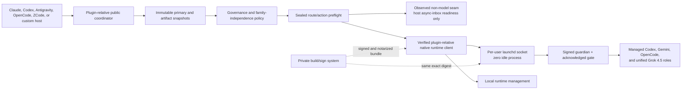

# agent-collab

[](https://github.com/sumitake/agent-collab/actions/workflows/ci.yml)
[](https://github.com/sumitake/agent-collab/actions/workflows/codeql.yml)
[](https://github.com/sumitake/agent-collab/actions/workflows/secret-scan.yml)

**agent-collab** gives Claude, Codex, Antigravity, OpenCode, ZCode, and custom
primary hosts one dynamic, governed collaboration surface, without publishing
provider executors or maintaining host-specific plugin copies. It resolves the
active primary and its model, host, and session dynamically, enforces
cross-family reviewer independence, and routes managed provider work (Codex,
Gemini, OpenCode, and unified Grok 4.5) through a verified, signed native runtime.

This public repository distributes one package, **agent-collab** (v4.2.2), and is
the source of truth for the coordinator policy, skills, migration tooling, the
fail-closed runtime client, contribution governance, and release-safety checks.
The signed and notarized darwin-arm64 native runtime is committed in this
repository and advertised through a closed activation manifest; the build
credentials and signing infrastructure that produce it remain in a separate
private build/sign system.

Contributors need no access to the private build/sign system. See
[public governance](docs/public-governance.md),
[migration guidance](docs/migration-from-legacy-packages.md), and the
[security policy](SECURITY.md).

## What this is not

- Not an open-source grant. It is source-available under the PolyForm Strict
  License 1.0.0 (see [License](#license)).
- Not a shipper of provider executor source, raw provider invocation recipes,
  downloaders, post-install hooks, or a runtime cache. The private build/sign
  system stays private.
- Not a collection of host-specific plugins. One package carries native metadata
  for every supported host.
- Not a synchronous Claude path. Claude remains asynchronous inbox-only; the
  shared runtime never creates a synchronous Claude route.

## What it provides

- One unified `/agent-collab:*` skill surface (review, intent, code/security,
  QA, logic, brainstorming, debate, research, long-context, delegation,
  orchestration, readiness, teamwork, and migration) across every host.
- Dynamic primary-identity resolution (primary id, family, active model, host
  runtime, session) with cross-family reviewer, worker, tiebreaker, and fallback
  independence enforced fail-closed.
- Managed, broker-only provider routes (Codex, Gemini, OpenCode, and unified
  Grok 4.5), each with explicit, non-substitutable `target=` selection and
  sealed action authorities.
- A verified native runtime client: per-member SHA-256, Developer ID signature,
  online notarization, and Mach-O checks before any provider launch, with a
  typed-unavailable fallback on any failure.
- Zero-idle execution: a per-user launchd socket starts the signed runtime only
  when a request arrives and exits after one bounded response, with no resident
  process, polling loop, or ambient credentials.
- A provider-free migration doctor, policy-only safe mode, and a byte-level
  clean-public-repository history gate.
- Reproducible releases: signed annotated tags, deterministic SHA-256 evidence,
  an SPDX 2.3 SBOM, and matrix CI with CodeQL, Gitleaks, and secret scanning.

## Current package

| Package | Version | Role |
|---|---:|---|
| `agent-collab` | 4.2.2 | Unified skills, dynamic host policy, migration preflight, and verified native-runtime client |

## What's new - v4.2.2

- Verify notarization online at both the release gate and consumer activation
  (`codesign --test-requirement '=notarized' --check-notarization`), so a clean host
  (a GitHub-hosted CI runner or a freshly-installed end-user checkout) confirms the
  runtime is notarized instead of fail-closing. Empirically fail-closed when the
  Apple notary is unreachable, and it rejects unsigned, ad-hoc, and
  Developer-ID-signed-unnotarized binaries on macOS 14 and 15.
- Accept the exact sealed artifact snapshot required by the collaboration skills
  on the read-only `opencode/plan` route. OpenCode plan/review calls now preserve
  artifact bytes and author-model lineage instead of failing the coordinator's
  closed schema before reaching the managed runtime.

The full, versioned release history is in [CHANGELOG.md](CHANGELOG.md).

## System architecture



The plugin runtime client accepts no binary or member override. It selects only
the Darwin-arm64 standalone-bundle entry in `runtime-manifest.json`, requires
the fixed plugin-relative bundle and entrypoint, rejects links, path aliases,
unknown members, writable modes, and parent traversal, then verifies every
member's size, SHA-256, Mach-O type, architecture, minimum macOS, signing
profile, and the domain-separated whole-bundle identity. Production also
requires the pinned Developer ID team and notarization assessment. It then uses
the fixed broker/provider protocols with a scrubbed environment. Every artifact
advertises its exact route/action contracts;
the client rejects unadvertised rows, mismatched route/authority combinations,
and author-family provenance drift. Missing, blocked, unsigned, mismatched, or
unsupported artifacts fail closed with typed status.

Codex, Gemini, OpenCode, Grok, and Composer use a digest-bound, per-user launchd Unix socket. Launchd
owns the mode-`0600` socket and starts the exact signed runtime only when a
request arrives. The broker accepts one bounded request, runs it through the
managed backend, returns one bounded response, and exits; there is no
`KeepAlive`, `RunAtLoad`, polling loop, interval, calendar trigger, or resident
agent process. At idle, launchd retains only the job registration and one
mode-`0600` Unix listening socket; the installed immutable bundle consumes disk
but no provider process, polling CPU, provider memory, or network traffic. Only
local runtime-management calls retain the fixed direct exact-entrypoint path.
Missing, stale, or mismatched broker state is a typed
failure and never falls back to direct execution for any broker-only route.
Updates use a legacy-default blue/green selector. A candidate dispatcher is
published under a distinct content-derived label and socket, then proven with a
no-provider ping while blue remains selected. Every request captures its lane
ordering once: an in-flight blue request completes on blue, while the next
request after atomic selector commitment selects green. Green may fall back to
the still-proven blue lane only before any request bytes are accepted; it never
retries blue after green accepts a request. Blue is retained until an explicit
drain operation proves green, observes blue quiescence, receives the private
registry/lock drain gate, and confirms host-client finalization. Codex host
updates use a distinct marketplace-qualified candidate because a same-selector
update deletes the prior cache; the migration doctor permits this bounded
two-selector overlap because both entries are the unified `agent-collab`
package, while retired package names remain blocking. The old selector/cache is
removed only after fresh sessions prove the candidate selector, version, and
loaded-path digest with zero old-client sessions.

Gemini, Grok, and OpenCode use one canonical cross-lane lock for the entire
request through provider teardown. The packaged lock probe proves both
contention and acquisition against that namespace without reading credentials
or invoking a provider. This makes mixed old/new host clients safe while all
normal traffic remains blue and prevents blue and green from concurrently
mutating the same provider state.
The broker removes the Codex Desktop outer-Seatbelt marker before backend
dispatch because socket activation does not inherit the client's Seatbelt.
Every brokered Grok and Composer attempt must therefore build and validate its
own nested read-only sandbox. Provider children receive closed backend-specific
environment allowlists with canonical passwd HOME for reliable authenticated
state plus fresh private temporary/cwd roots rather than the broker's ambient
environment. Grok uses real serialized `~/.grok`; OpenCode keeps private XDG
roots and selected-provider auth; Codex keeps a sealed per-call `CODEX_HOME`,
SQLite, and XDG overlay. Provider-specific policy overlays may narrow
credentials or tools without replacing process HOME. Broker frames cannot
invoke local runtime-management actions.
If the client disconnects, the broker propagates cancellation through every
managed provider route, reaps provider child groups,
and discards partial output. Disconnect-driven cancellation is never retried;
when too little deadline remains to establish the managed boundary, the route
returns typed `timeout` before provider setup.
Gemini uses the managed agy backend with canonical passwd HOME, mandatory PTY,
serialized state, and write containment. `gemini/governance` is distinct from
advisory/long-context and emits complete artifact-bound broker proof; ordinary
Gemini output cannot be presented as governance evidence.

The broker rejects cross-UID, stale/replayed, substituted-artifact, and
connecting-process mismatches. It does not claim to protect provider
credentials from arbitrary malicious code already running as the same operator
UID, which can already read that user's auth state. The exact immutable bundle,
entrypoint path, member inventory, and identity are revalidated for each
request.

The expected Apple Developer ID Team ID is pinned in the public
`plugins/agent-collab/signing_policy.py` policy source, independently of the
runtime manifest, and is checked against every runtime member's signature during
verification. An activation release refuses to publish unless the committed
bundle matches that pinned team and passes notarization; a policy-only release
carries no runtime and keeps every native route typed unavailable.

Governance plus applicable review, fallback, and worker calls carry the
captured artifact separately from the instruction prompt. The sealed native
JSON represents its exact bytes
as base64 plus SHA-256, byte size, author model, and derived author family. The
client decodes and verifies the representation before launch; neither the
coordinator nor the native runtime may reconstruct the artifact from a prompt
copy.

The signed and notarized darwin-arm64 runtime bundle is committed in this
repository (first shipped in the v4.2.x activation release). Native Codex,
Gemini, OpenCode, and Grok 4.5 routes activate once a host installs the plugin,
verifies the runtime, and installs the broker; until then they remain typed
unavailable, and a policy-only fallback keeps every native route unavailable by
design. Deterministic tests use temporary fixture bundles only. The release gate
requires every platform artifact to expose the complete required contract
matrix, including the `composer/codegen` compatibility route.

## Production lifecycle

1. Public policy or protocol changes are reviewed and validated in this
   repository; private runtime changes remain inside the build/sign system.
2. The private producer runs its containment, provenance, and
   authority-boundary tests without exporting implementation source.
3. The private producer builds one Darwin-arm64 standalone bundle, signs every
   nested Mach-O before the entrypoint with hardened runtime, notarizes the
   closed bundle, and records whole-bundle plus per-member evidence.
4. A policy-only plugin release omits the runtime and keeps every native route
   typed unavailable. An activation release commits the final signed and
   notarized bundle, its closed manifest metadata, and the exact third-party
   notice/license tree; no private source implementation crosses the boundary.
5. Plugin CI validates both Claude and Codex manifests/marketplaces, schemas,
   skills, migration behavior, runtime fixtures, the dependency-free secret
   scan, CodeQL security analysis, release consistency, and public-export
   safety.
6. A policy-only signed-tag release proves the runtime manifest is empty and
   the archive contains no runtime. For activation, a macOS verification job
   binds every member's codesign/Mach-O evidence, entrypoint notarization,
   manifest digest, whole-bundle identity, and commit SHA before the publish job
   may include the bundle. SPDX 2.3
   evidence distinguishes project-owned PolyForm material from the embedded
   CPython, Nuitka, and incorporated third-party components.
7. Hosts update one package, run the migration doctor, restart, and verify the
   resolved profile plus eligible routes. Initial activation hosts run the
   co-packaged `runtime_setup.py status` and `prepare` commands, then explicitly
   run `install-broker`. Subsequent updates stage a distinct dispatcher, install
   every dual-lane client beside the old client while blue remains selected,
   prove ping and canonical locks, then commit, session-gate old-client
   finalization, and separately drain through the private manager. Managed Grok
   device login is exposed only as `runtime_setup.py login-grok`.
8. Dispatcher updates copy only manifest-listed regular bundle members and the
   manifest into an immutable artifact-plus-manifest digest directory. Staging
   writes only candidate plist/state plus a blue-selected selector, verifies the
   exact candidate job/socket, executes one protocol-only ping, and proves the
   process exits. Failure restores the prior selector bytes and removes only the
   candidate. Commitment is a one-generation selector CAS and never bootouts
   blue. Bounded `launchctl` timeout/output failures remain typed lifecycle
   errors rather than escaping as host tracebacks.

Rollback uses policy-only safe mode. Set `AGENT_COLLAB_SAFE_MODE=1` in the
active host runtime environment and restart that host; all model-execution
requests then return typed unavailable. An independently configured host inbox
may still report readiness, but the public coordinator never sends through it;
without a current availability observation it is unavailable too. Unset safe
mode and restart after validation. Rollback never reinstalls an old package.

## Install and migrate

Claude Code:

```text
/plugin marketplace add sumitake/agent-collab
/plugin install agent-collab@agent-collab
/agent-collab:migration-doctor
```

Codex CLI/app:

```text
codex plugin marketplace add sumitake/agent-collab
codex plugin add agent-collab@agent-collab
```

The same package carries native metadata for both hosts:
`plugins/agent-collab/.claude-plugin/plugin.json` for Claude-compatible package
managers and `plugins/agent-collab/.codex-plugin/plugin.json` for Codex. The
repository Codex marketplace is generated at
`.agents/plugins/marketplace.json`; it contains only `agent-collab`.

Then invoke the `agent-collab` migration-doctor skill from a new Codex task.
Antigravity, OpenCode, ZCode, and custom hosts must select the same single
package through their compatible plugin manager; if that host has no native
plugin surface, it cannot install this package directly and must remain
temporarily unsupported rather than recreating a provider-specific shim.

The retired standalone packages migrate to the unified `agent-collab`:

- `codex-tools →` managed Codex backend in `agent-collab`
- `glm-worker →` managed OpenCode backend in `agent-collab`, with
  `opencode/glm-5.2` as the current Zhipu-family model preset
- host-specific collaboration packages → dynamic host profiles in
  `agent-collab`

The exhaustive namespace and skill table is in
[docs/migration-from-legacy-packages.md](docs/migration-from-legacy-packages.md).

An activation release adds a closed signed-runtime management surface beside
the coordinator. Resolve the installed plugin root and run only:

```text
python3 "<plugin-root>/runtime_setup.py" status
python3 "<plugin-root>/runtime_setup.py" prepare
python3 "<plugin-root>/runtime_setup.py" install-broker
python3 "<plugin-root>/runtime_setup.py" broker-status
python3 "<plugin-root>/runtime_setup.py" dispatcher-status
python3 "<plugin-root>/runtime_setup.py" login-grok
```

These operations accept no provider, model, path, environment, binary, tool,
or raw-argument overrides. The public client keeps the process environment
scrubbed and sends only `generic` or `codex_desktop` as a closed host-context
observation; the signed runtime derives and validates its own state roots from
the OS login identity. Exact supported Codex, OpenCode, and Grok CLIs remain
external prerequisites and must be installed and authenticated through their
vendor-supported interfaces. No workspace checkout or provider-specific plugin
is required. Policy-only releases report the management surface unavailable.

Broker lifecycle is always explicit: import, readiness, route invocation, and
package auto-update do not install or modify launchd state. The private rollout
manager invokes these closed update primitives in order after its host and
provider gates:

```text
python3 "<plugin-root>/runtime_setup.py" stage-dispatcher
python3 "<plugin-root>/runtime_setup.py" dispatcher-ping
python3 "<plugin-root>/runtime_setup.py" dispatcher-lock-probe --provider gemini --timeout-ms 5000
python3 "<plugin-root>/runtime_setup.py" commit-selector
python3 "<plugin-root>/runtime_setup.py" drain-retiring
```

Reject an uncommitted candidate or rebuild mutable files from the committed
selector without changing desired provider binaries:

```text
python3 "<plugin-root>/runtime_setup.py" abort-candidate
python3 "<plugin-root>/runtime_setup.py" recover-last-committed-control-plane
```

Manual historical switching and complete removal remain separately named and
are never invoked by package auto-update:

```text
python3 "<plugin-root>/runtime_setup.py" rollback-broker
python3 "<plugin-root>/runtime_setup.py" uninstall-broker
```

`broker-status` is read-only and value-free: it reports only installation,
the canonical selected lane, job/socket state, artifact/manifest digests,
closed liveness readiness, rollback availability, and the fact that no
persistent process is configured. It never invokes a provider. Lifecycle
commands accept no caller-selected path, label, socket, environment, provider,
model, or raw argument.

Remove every old package reported by the doctor, then run the doctor again.
The doctor reads filesystem/registry state and Codex
`[plugins."name@marketplace"]` entries from `~/.codex/config.toml`, distinguishes
enabled from installed-disabled state, preserves the observed source host, and
prints uninstall commands for that host's package manager. It also requires
the signed runtime and canonical broker path to pass a provider-free closed
liveness exchange. Provider routing stays blocked while a retired package
remains installed or active or executable broker readiness is unproven. Cached
but unselected residue is reported separately.

For an unknown/custom primary, explicitly configure:

| Profile field | Environment variable |
|---|---|
| `primary_id` | `AGENT_COLLAB_PRIMARY_ID` |
| `primary_family` | `AGENT_COLLAB_PRIMARY_FAMILY` |
| `active_model` | `AGENT_COLLAB_ACTIVE_MODEL` |
| `host_runtime` | `AGENT_COLLAB_HOST_RUNTIME` |
| `session_identifier` | `AGENT_COLLAB_SESSION_ID` |
| asynchronous inbox availability | `AGENT_COLLAB_ASYNC_INBOX` |

Known profiles still refresh their active model/family observation before each
invocation. OpenCode is a host runtime, not a model family; GLM output carries
Zhipu provenance. Model lineage is parsed from exact provider and model-id
segments; conflicting lineage signals or incidental substrings resolve to
unknown rather than whichever family happens to match first. Automatic
detection relies on strong session signals
(`CODEX_THREAD_ID`, `CLAUDE_CODE_SESSION_ID`/entrypoint,
`ANTIGRAVITY_SESSION_ID`, or `ZCODE_SESSION_ID`), never ambient installation
paths such as `CODEX_HOME` or `OPENCODE_CONFIG`.
When Codex Desktop omits `CODEX_ACTIVE_MODEL`, the policy resolves the exact
lowercase-UUID thread's same-owner rollout file from the fixed Codex sessions
tree and uses its newest complete, internally consistent OpenAI turn context.
Ambiguous, linked, writable, malformed, oversized, or conflicting evidence
fails governance closed; no model is guessed from configuration or defaults.
The OpenCode model is selected on every request in this order: a strong live
OpenCode or ZCode active-model observation, explicit central
`primary.opencode_model` configuration, then the fixed current preset
`opencode/glm-5.2`. Ambient environment values and row-level model fields are
not selection fallbacks. A live session switch therefore changes provenance on
the next request; an Anthropic or unknown selected model is prohibited.

`AGENT_COLLAB_ASYNC_INBOX=available` (or request field
`primary.async_inbox="available"`) is an availability observation, not a send
primitive. The public coordinator accepts only `inbox/async` with
`operation=readiness`, non-governance authority, and an exact target row:
`{"target_id":"claude|antigravity","target_family":"anthropic|google","target_session_identifier":"..."}`.
The id/family pair and nonblank target session must be trustworthy, and the
target family must differ from the current primary family. Execute or
governance requests are schema errors; the coordinator never sends and never
invokes Claude headlessly. The host-owned async transport performs any later
handoff.

## Skill surface

The unified package includes review, intent, code/security, QA, logic,
brainstorming, debate, research, long-context, visual-workflow, delegation, orchestration,
readiness, teamwork, migration, and explicit managed-routing skills under the
single `/agent-collab:*` namespace. Provider targets are request parameters,
not plugin identities.

The current protocol has no typed image or binary-media field. `visual-review`
and `ui-to-code` therefore provide an explicitly primary-only workflow or
report managed independent visual review unavailable; they never invent a
path-based attachment or raw-provider fallback.

Explicit `target=gemini`, `target=codex`, and `target=opencode` requests are
fail-closed and never silently substituted. Gemini has separate read-only
advisory, governance, and long-context actions; Codex advisory and OpenCode plan/workspace-write authority are
sealed separately and never promote or demote into one another. Codex build is
a resolvable mutation-capable request but returns typed unavailable until a
hardened mutation backend exists; it never widens advisory.

Managed xAI targets are equally explicit: `target=grok` has separate read-only
architecture, governance, and huge-context actions; `target=composer` is the
compatibility name for constrained Grok 4.5 output-only code generation. That
route has no file, shell, test, worktree, PR, or merge authority. All remain
deterministically temporarily
unavailable until the signed runtime advertises their exact route/action contracts.
Codex, Gemini, OpenCode, Grok, and Composer requests are broker-only and never fall back to direct runtime
execution. Grok prose accepts only an explicit `EndTurn` terminal; exact
`Cancelled` is a named non-success with no retained assistant text and may be
retried once only when more than ten seconds remain under the original
deadline. Final UTF-8 input above the inclusive 1,048,576-byte managed ceiling
returns `input_limit` before provider authentication or spawn.
Grok 4.5 is reachable only through sealed `architecture`, `governance`, or
`huge_context` actions; generic advisory, brainstorm, debate, QA, and fallback
requests cannot select it. OpenCode build is a distinct mutation-capable
workspace-write action and never aliases its read-only plan action.
Applicable non-governance review, fallback, and worker requests may include an
exact immutable artifact snapshot; its author model is resolved independently
and that family is excluded from selection alongside the active primary family. An
unknown artifact-author family emits an independence warning for
non-governance work and fails governance closed.

For non-trivial code generation, Grok 4.5 through `composer/codegen` must receive a comprehensive coding
packet produced by the primary architect and reviewed by an eligible
distinct-family synchronous architecture complement. The packet defines scope,
invariants, authority boundaries, exact files and symbols, error taxonomy,
lifecycle, tests, and acceptance criteria. Claude and Codex frontier primaries
are the strongest default architecture seats; Grok 4.5 is the qualified
near-peer/adversarial architecture complement. The compatibility codegen route implements the
converged packet; it never plans the architecture. Asynchronous inbox review is
a fallback only when no eligible synchronous complement is available.

## Clean public repository invariant

This repository, every reachable ref, and every release archive must remain
free of provider executor source, raw provider invocation recipes, private
absolute paths, credentials, retired package trees, and unreviewed native
artifacts. The byte-level history gate inspects every ref and reachable commit,
tree, blob, annotated-tag object, and message, including direct non-commit refs.
It validates release-tag form and targets, recursively scans nested archive
members under cumulative depth, member-count, per-member, and decompressed-size
limits, and rejects provider-backend archive directories, symlinks, and other
unsafe tree modes. Python AST evaluation also catches statically constructed
provider argv; only explicit harmless audit-literal declarations are masked.

Pull-request workflows use GitHub-hosted runners and receive no private
build/sign credentials. If contamination is suspected, stop publication and
report it privately under [SECURITY.md](SECURITY.md); do not copy the suspected
material into a public issue or pull request.

```text
python3 scripts/check-public-export-safety.py --active-tree --history
```

## CI and security

Comprehensive CI runs the full repository and script suites on Python 3.10,
3.12, and 3.14. A separate repository-contract job checks generated skills and
marketplaces, changelog and release consistency, policy-archive construction,
checksum/SPDX evidence, JSON, workflow syntax, public-export safety, secrets,
and whitespace. Existing specialized governance and release gates remain
independently visible.

All pull-request code runs on GitHub-hosted runners without private build or
signing credentials. Every third-party GitHub Action uses a full commit SHA pin;
Dependabot proposes reviewed updates to those pins.

Security scanning is layered:

- CodeQL analyzes Python with the `security-extended` query suite on pull
  requests, `main`, a weekly schedule, and manual dispatch.
- The dependency-free local scanner fails closed on high-confidence credential
  patterns in tracked and non-ignored untracked bytes.
- Gitleaks scans complete repository history on pull requests, `main`, a weekly
  schedule, and manual dispatch.
- GitHub native secret scanning and push protection provide server-side
  detection before and after a push.

Branch protection requires current CI, CodeQL, secret-scan, and governance
results. Sensitive workflow, security, legal, and instruction surfaces have
explicit CODEOWNERS coverage. Repository settings allow squash merges only,
delete merged branches, require signed commits and linear history, keep the
default workflow token read-only, and require third-party Actions to be pinned
to full commit SHAs.

## Development and release verification

Run the deterministic gates before a release candidate:

```text
python3 scripts/build_skills.py --check
python3 scripts/build_marketplace.py --check
python3 scripts/build-changelog.py --check
python3 -m unittest discover -s tests -t . -v
python3 -m unittest discover -s scripts -p 'test_*.py' -v
python3 scripts/check_release_consistency.py
python3 scripts/build_plugin_archive.py --output /tmp/agent-collab.plugin
python3 scripts/secret_scan.py
python3 scripts/check-public-export-safety.py --active-tree
git diff --check
```

The archive builder classifies and verifies either the current policy-only
package or an activation package. For an activation candidate, also run
`python3 scripts/verify_runtime_release.py --git-sha "$(git rev-parse HEAD)"`
on Darwin arm64; that verifier intentionally remains activation-only and fails
closed against an empty manifest.

Activation packaging also requires the exact digest-pinned
`THIRD-PARTY-NOTICES.txt` and `third-party-licenses/` tree. Missing, extra,
linked, hardlinked, unsafe, or modified legal members fail before archive or
SBOM publication. Policy-only archives intentionally omit that tree.

`CHANGELOG.md` remains generated at release time from `changelog.d/` fragments.
Historical changelog entries may name retired packages only as clearly
historical records; they are not active install or rollback instructions.
Release tags must be signed annotated tags whose target is the checked-out
commit on `origin/main`; the release workflow verifies the GitHub tag signature
and main ancestry before accepting macOS runtime evidence or building archives.
Activation runtime evidence also binds inspection of a thin arm64 Mach-O with
exactly one macOS `LC_BUILD_VERSION` declaring minimum macOS 14.0; manifest
labels alone do not establish architecture or deployment target. In policy-only
mode, the archive builder requires an empty artifact list and proves that no
runtime path is packaged; the activation-only verifier is not run.
Release consistency additionally requires the Claude and Codex plugin
manifests to have the same name/version and the generated Codex marketplace to
contain exactly the one local unified package.

## License

The public repository and distributed package use the unmodified
[PolyForm Strict License 1.0.0](LICENSE). This is a source-available license,
not an open-source grant: it permits the uses described in the license and does
not permit redistribution, changes, derivative works, or commercial use.

Copyright is owned by John Osumi. Commercial use requires separate, explicit
written approval administered by Osumi Consulting LLC. Repository access,
installation, GitHub activity, and an accepted contribution do not constitute
approval. See [NOTICE](NOTICE) and
[COMMERCIAL-LICENSING.md](COMMERCIAL-LICENSING.md) for the exact ownership and
approval boundary.

An activation archive also redistributes CPython 3.13.14, Nuitka 4.1.3 runtime
material, and their incorporated components under their own terms. The exact,
digest-pinned inventory is shipped as `THIRD-PARTY-NOTICES.txt` and
`third-party-licenses/` inside the plugin package. Those files are excluded from
policy-only archives because no native runtime is present.
