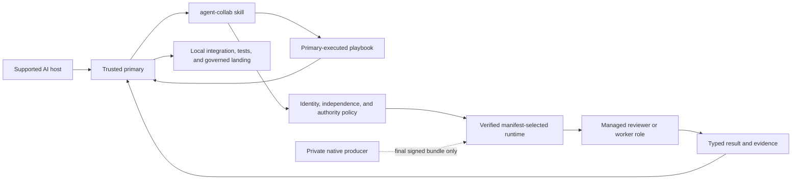

# agent-collab

[](https://github.com/sumitake/agent-collab/actions/workflows/ci.yml)
[](https://github.com/sumitake/agent-collab/actions/workflows/codeql.yml)
[](https://github.com/sumitake/agent-collab/actions/workflows/secret-scan.yml)

`agent-collab` is a source-available plugin for governed collaboration among
AI coding agents. It gives the trusted primary reusable workflows for independent
review, planning, assurance, delegation, knowledge work, orchestration, and
domain expertise while keeping reviewer independence and execution authority
explicit.

The core idea is simple: different model families fail differently. A review
from the author's own family is useful, but it is not independent governance
evidence. `agent-collab` resolves current lineage, excludes ineligible families,
seals each managed route to a declared authority, and returns typed failures
instead of silently widening permissions or invoking a raw provider fallback.

## What it is—and is not

`agent-collab` provides:

- one unified package and `/agent-collab:*` skill namespace;
- 50 generated skills spanning review, planning, delegation, orchestration,
  engineering process, and specialist domains;
- dynamic primary and artifact-author lineage with cross-family independence;
- closed read-only and output-only managed routes;
- provider-free migration and runtime-readiness checks;
- a verified, manifest-selected native runtime boundary where the selected
  source tree or release contains activation material; and
- public contribution, CI, security, and release-safety contracts.

It is not:

- a general AI swarm with equal authority for every agent;
- a raw provider CLI wrapper or provider-executor source distribution;
- a set of host- or provider-specific plugins;
- an autonomous merge, deployment, or governance service;
- a guarantee that every listed route is active on every host; or
- an open-source license grant. The public code is source-available under
  PolyForm Strict 1.0.0.

## Why the controls matter

- **Independent failure modes:** governance review excludes the active primary
  and reviewed artifact's known author family.
- **Least authority:** advisory work stays read-only; output-only workers return
  artifacts for the primary to inspect and apply.
- **Honest uncertainty:** unknown lineage, unavailable native contracts,
  migration conflicts, and same-family requests remain typed and fail closed.
- **Separation of duties:** provider output cannot merge, deploy, change policy,
  or approve itself.
- **Operator control:** reserved security, governance, release, activation, and
  recovery decisions remain with the operator where public policy requires it.

Read [Governance and authority](docs/architecture/governance-and-authority.md)
for the complete model and its documented residuals.

## Current package and evidence state

| Package | Source version | Role |
| --- | ---: | --- |
| **agent-collab** (v4.9.1) | 4.9.1 | Unified skills, host policy, migration, verified runtime client, and public release checks. |

Version words are easy to misuse. This README describes the current repository
source. A signed tag, GitHub release, installed package, selected package, and
runtime-ready host are separate facts.

At the 2026-08-05 authoring snapshot, `origin/main` began at 4.9.0, the latest
GitHub release record was v4.5.1, a signed v4.6.0 tag existed without a GitHub
release record, and the repository contained newer staged changelog fragments.
This change advances repository source to 4.9.1. It makes no claim about a
specific host installation or active route.

See [Status and evidence](docs/architecture/status-and-evidence.md) for the
binding lifecycle vocabulary and dated evidence matrix.

## What's new - v4.9.1

- Added an indexed, sanitized public architecture handbook covering system
  context, capabilities, governance, lifecycle operations, repository/release
  architecture, and evidence-state distinctions.
- Rebuilt this README as a public entry point instead of a second low-level
  protocol reference.
- Corrected stale package metadata and technical-reference statements about the
  committed activation artifact, package version, signing anchor, and current
  manifest generation.
- Added a design-evidence registry that distinguishes current cited design
  sections from superseded and historical review material.

Earlier release and staged change notes live in
[`changelog.d/`](changelog.d/) and are compiled into
[`CHANGELOG.md`](CHANGELOG.md) by the release flow.

## Architecture at a glance


```mermaid
flowchart LR
    Host["Supported AI host"] --> Primary["Trusted primary"]
    Primary --> Skill["agent-collab skill"]
    Skill --> Local["Primary-executed playbook"]
    Skill --> Policy["Identity, independence, and authority policy"]
    Local --> Primary
    Policy --> Runtime["Verified manifest-selected runtime"]
    Runtime --> Role["Managed reviewer or worker role"]
    Role --> Result["Typed result and evidence"]
    Result --> Primary
    Primary --> Verify["Local integration, tests, and governed landing"]
    Producer["Private native producer"] -. "final signed bundle only" .-> Runtime
```

The public repository owns skills, coordinator policy, client behavior,
migration, governance, tests, and release checks. Native provider
implementation and build/sign credentials remain in a separate private
producer. The repository may receive only the final reviewed standalone bundle,
its closed manifest metadata, and required license evidence.

The package's current public policy distinguishes read-only review/context
roles from output-only code generation. Output-only work occurs in a private
temporary workspace and returns material for trusted-primary review; it does
not receive caller-workspace write authority. Direct CLI use is not a normal
fallback for a managed route.

Start with the [architecture handbook](docs/architecture/README.md). The
[package reference](plugins/agent-collab/README.md) retains the low-level
coordinator and runtime contracts.

## Features and workflows

| Need | Start with |
| --- | --- |
| Independent review | `second-opinion`, `code-review`, `governance-review`, `red-team`, `qa-verify` |
| Architecture and planning | `architect`, `brainstorm`, `architecture-review`, `intent-check`, `decision-map` |
| Delegated research or implementation | `delegate`, `dev-delegate`, `worker`, `teamwork` |
| Reproducible multi-step work | `chain`, `chain-configurator`, `orchestrate` |
| Large-context synthesis | `knowledge-compile`, `long-context` |
| Readiness and migration | `agent-readiness`, `agent-runtime-status`, `migration-doctor`, `route` |
| Specialist engineering | Language, infrastructure, reliability, data, AI, evaluation, and writing-quality skill packs |

Some skills are primary-executed playbooks; others use managed synchronous
routes. Claude and Antigravity can participate through host-owned async
coordination only after explicit target/session readiness is observed. The
public coordinator never sends and never invokes Claude headlessly. Visual
skills remain primary-only where the protocol has no typed image transport.

The full map is in
[Capabilities and workflows](docs/architecture/capabilities-and-workflows.md).

## Install

### Claude Code

```text
/plugin marketplace add sumitake/agent-collab
/plugin install agent-collab@agent-collab
/agent-collab:migration-doctor
```

### Codex CLI/app

```text
codex plugin marketplace add sumitake/agent-collab
codex plugin add agent-collab@agent-collab
```

Start a new Codex task, then invoke `agent-collab:migration-doctor` and
`agent-collab:agent-runtime-status`.

Claude Code and Codex have native package manifests in this repository. Other
hosts need a compatible plugin manager and must preserve the same single-package
boundary; otherwise they are unsupported.

For verification, updates, safe mode, troubleshooting, rollback, and removal,
use the complete [Lifecycle and operations guide](docs/architecture/lifecycle-and-operations.md).

## Migration from retired packages

The old standalone generation maps into the unified package:

- `codex-tools →` managed Codex backend in `agent-collab`;
- `glm-worker →` managed OpenCode backend in `agent-collab`; and
- host-specific collaboration packages → dynamic host profiles in
  `agent-collab`.

Routing stays blocked while an active or installed retired package remains or
provider-free native readiness is unproven. Cached-but-unselected residue is
reported separately. Safe mode is the rollback boundary; reinstalling a
retired package is not.

See [Unified agent-collab migration](docs/migration-from-legacy-packages.md).

## Documentation

| Document | Audience |
| --- | --- |
| [Architecture handbook](docs/architecture/README.md) | Users, contributors, reviewers, and maintainers who need the whole system map. |
| [Lifecycle and operations](docs/architecture/lifecycle-and-operations.md) | Users installing, verifying, updating, troubleshooting, rolling back, or removing the package. |
| [Capabilities and workflows](docs/architecture/capabilities-and-workflows.md) | Users choosing the right skill or collaboration shape. |
| [Governance and authority](docs/architecture/governance-and-authority.md) | Reviewers and maintainers evaluating independence and permissions. |
| [Repository and release architecture](docs/architecture/repository-and-release.md) | Contributors and release maintainers. |
| [Package technical reference](plugins/agent-collab/README.md) | Maintainers integrating the closed coordinator/runtime contract. |
| [Public repository governance](docs/public-governance.md) | Contributors and merge reviewers. |
| [Security policy](SECURITY.md) | Private vulnerability reporting. |
| [Design and review evidence](docs/design/README.md) | Maintainers researching design history without treating it as current by default. |
| [Third-party skill provenance](docs/third-party-skill-provenance.md) | License and provenance reviewers. |

## Security and public boundary

Every active path, locally reachable ref, and release archive must stay free of
provider executor source, raw provider invocation recipes, private absolute
paths, credentials, retired package trees, and unreviewed native artifacts.
Suspected exposure is reported privately under [SECURITY.md](SECURITY.md);
scanner output must not be pasted into a public issue or pull request.

Security checks include:

- CodeQL with the `security-extended` query suite;
- a dependency-free tracked/untracked credential scanner;
- Gitleaks across repository history;
- GitHub native secret scanning and push protection;
- full commit SHA pins for third-party GitHub Actions; and
- reviewed Dependabot updates for those pins.

Pull-request jobs use GitHub-hosted runners without private build/sign
credentials. Current repository rules require a pull request, required checks,
signed commits, linear history, and resolved review threads. See
[Governance and authority](docs/architecture/governance-and-authority.md) for
the hosting-platform bypass caveat and no-admin-bypass merge rule.

## Contributing and validation

Read [`AGENTS.md`](AGENTS.md) and
[`docs/public-governance.md`](docs/public-governance.md) before changing the
repository. Edit `skill-specs/`, not generated skill copies, and commit one
unique `changelog.d/` fragment for a user-visible change. Do not commit a
feature-branch compilation of `CHANGELOG.md`.

Required local validation:

```text
python3 scripts/build_skills.py --check
python3 scripts/build_marketplace.py --check
python3 scripts/build-changelog.py --dry-run
python3 -m unittest discover -s tests -t . -v
python3 -m unittest discover -s scripts -p 'test_*.py' -v
python3 scripts/check_release_consistency.py
python3 scripts/secret_scan.py
python3 scripts/check-public-export-safety.py --active-tree
git diff --check
```

Release preparation adds deterministic archive/evidence, secret, history, tag,
and—for activation—Darwin arm64 signature/notarization verification. The
complete lifecycle is documented in
[Repository and release architecture](docs/architecture/repository-and-release.md).
After all other release work finishes, that lifecycle ends with a
[documentation closeout](docs/architecture/repository-and-release.md#final-documentation-closeout)
that aligns the architecture handbook, this README, and changelog evidence
without exposing private executor recipes.

## License

The repository and package use the unmodified
[PolyForm Strict License 1.0.0](LICENSE), except for identified MIT-derived
skill portions that retain their MIT terms. This is source-available software,
not an open-source grant. Commercial use requires separate explicit written
approval administered by Osumi Consulting LLC. See [NOTICE](NOTICE),
[COMMERCIAL-LICENSING.md](COMMERCIAL-LICENSING.md), and
[third-party provenance](docs/third-party-skill-provenance.md).
