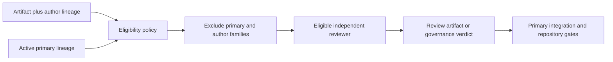

# Governance and authority

< [Architecture handbook index](README.md)

`agent-collab` separates authorship, independent review, execution authority,
and landing authority. This matters because a model is least reliable at
finding the blind spots shared by its own family, and because a successful
tool call is not evidence that the caller should receive broader permissions.

## Independence model

For governance-grade review, repository and skill policy requires a recorded
active-primary lineage and artifact-author lineage. The primary must select
and preserve evidence from a reviewer outside both required families. If either
lineage is unknown, the governance workflow fails closed. OpenCode is a
transport/host surface; the selected model's lineage supplies family provenance.

The current public runtime request has no primary or artifact-author-lineage
field. It does not dynamically perform this exclusion. The skill and repository
workflow require it, and the primary verifies the selected reviewer and the
substance of the exact-head review.

The diagram does not make reviewer output self-authenticating. Repository
automation validates declared evidence form; the primary, reviewers, and
operator remain responsible for its substance.

## Authority classes

Repository and skill workflows assign these responsibilities; they must not
be mistaken for additional sandbox guarantees in the routing envelope:

| Authority | Meaning | Examples in the current public contract |
| --- | --- | --- |
| **read-only** | May inspect bounded input and return analysis, review, plans, or context. | Claude document intent, Gemini advisory/governance/context, Codex advisory/governance, OpenCode plan/context/governance, Grok architecture/governance/context. |
| **output-only** | The caller supplies a disposable repository or copy, captures output or patches, reviews/tests them, and owns application and cleanup. | Admitted code-generation work; inspect the current descriptor for eligible targets. |
| **unavailable** | The contract name is recognized but no hardened backend currently satisfies it on the observing host or runtime. | Any route whose typed readiness result is unavailable; this is not inferred from the descriptor alone. |
| **primary-executed** | The active primary follows the skill locally; no independent managed route is implied. | Self-executed engineering-process skills and primary-only visual guidance where typed media transport is absent. |
| **async readiness** | Host tooling checks whether an explicitly authorized async target is addressable. | Separate from the public routing request; the coordinator does not send or report async readiness. |

No failure converts one row to another. In particular:

- an advisory route cannot become a worker because another worker is
  unavailable;
- the runtime does not itself apply output; callers must supply a disposable
  copy and verify it before application;
- the governance workflow cannot accept an unknown primary or artifact family;
- an explicit target is not silently replaced by a different provider; and
- a successful result does not gain merge, deployment, release, or policy
  authority.

## Role boundaries

| Role | Owns | Must not own |
| --- | --- | --- |
| User/operator | Objective, hard constraints, reserved paths, release/activation policy, and final human decisions. | Routine implementation detail that policy already delegates safely. |
| Primary | Intent interpretation, architecture synthesis, integration, tests, conflict resolution, and in-scope landing decisions. | Independent review of its own family or authority beyond the user and repository contract. |
| Reviewer | Counter-arguments, defects, risks, and an evidence-bound verdict. | Editing the reviewed branch, merging, or silently changing scope. |
| Worker | A bounded research or implementation artifact under a declared authority. | Architecture/governance decisions, secret handling, merge/deploy, or caller-workspace write access unless explicitly provided by a future contract. |
| Repository automation | Deterministic checks for trace form, tests, generated state, security, and release consistency. | Judgment that a review was genuine or a change is desirable. |

## Repository change tiers

The self-contained public contribution contract defines three tiers:

- **Tier 1:** documentation, comments, or cosmetic metadata with no executable,
  policy, security, packaging, or release effect. A reasoned `N/A` independent
  cross-check is permitted.
- **Tier 2:** user-visible behavior, skills, tests, ordinary CI, dependencies,
  or compatible policy changes. Independent cross-family review is required.
- **Tier 3:** routing authority, family independence, provenance, sandboxing,
  authentication, signing, runtime verification, release supply chain, or
  governance gates. Independent cross-family review is required, and
  operator-reserved paths require operator merge.

The authoritative definitions and PR fields live in
[`docs/public-governance.md`](../public-governance.md).

## Compliance trace: what it proves

Every pull request records one compliance trace with eight required fields.
Local and CI checks validate its shape, tier rules, recognized cross-check
state, and reserved-path handling. A Tier 2 or Tier 3 pull request is not
merge-eligible on a bare `N/A`; it requires a converged `PROCEED` record.

The trace proves that required evidence was recorded in the expected form. It
does **not** cryptographically prove that quoted review prose came from the
claimed reviewer. This is an intentional, documented residual boundary:

- skill and repository policy require family independence, verified by the
  primary against the actual selected reviewer;
- repository automation validates trace form and presence; and
- the primary, independent reviewer, and operator validate substance and exact
  head before merge.

## Merge and release authority

Current repository settings require a pull request, signed commits, linear
history, required status checks, and resolved review threads; squash is the
allowed merge method. Administrative identities retain a pull-request bypass
capability at the hosting layer, so “no admin bypass” is a governance rule that
must be observed and audited, not a claim that the platform makes bypass
impossible.

Before merge:

1. review the exact head, not an earlier commit;
2. run the local compliance check against the pull request;
3. require all current status checks to pass;
4. resolve every actionable review thread;
5. honor CODEOWNERS and operator-reserved decisions; and
6. merge normally without an administrative bypass.

Release authority remains separate from merge authority. A merged version and
fragment are staged inputs until the signed-tag and release workflow completes
and its evidence is verified.

## Why these controls matter

- **Different failure modes:** independent model families are more likely to
  expose correlated assumptions than another instance of the author's family.
- **Least authority:** a route receives only the permission its work requires,
  reducing the cost of a hallucination or prompt-injection failure.
- **Honest evidence:** unavailable execution and explicitly unknown lineage
  remain uncertain; neither is converted into successful governance evidence.
- **Separation of duties:** authoring, reviewing, integrating, merging, and
  releasing remain distinct accountable acts.
- **Recoverability:** safe mode and retained verified state stop execution
  without reviving retired packages or bypassing migration checks.

For operational application of these rules, continue to
[Lifecycle and operations](lifecycle-and-operations.md). For the public PR
contract, read [`docs/public-governance.md`](../public-governance.md).
