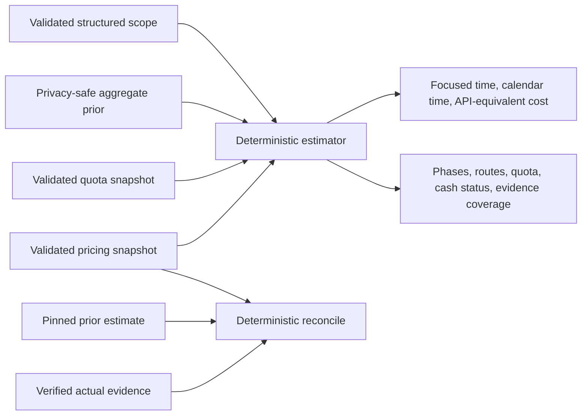

# Project estimation

< [Architecture handbook index](README.md)

`project-estimation` forecasts agent-led delivery from a structured scope. It
keeps four questions separate:

- How much focused wall-clock time will active agent execution take?
- How much calendar time will pass after operator, vendor, quota, and other
  waits are included?
- What would the planned token usage cost at the packaged current API rates?
- What marginal cash and quota consumption was actually observed?

The estimator is a deterministic, standard-library helper. It is not a hosted
service, model call, coordinator action, database, or background process.
Ordinary estimation is offline and read-only unless the caller explicitly
consents to an output path.

## Current status

The skill, helper, schemas, planning checkpoints, and release-verification
source ship in the published v6.2.0 release. A governed, content-addressed
bootstrap handoff is admitted from the frozen producer. It contains a supported
enhancement duration hierarchy but no greenfield root and no published token,
wait, rework, quota-delay, or marginal-cash metrics.

This is production maintenance evidence in the explicit `bootstrap` state, not
a promoted calibration claim. Its estimates are descriptive and never high
confidence. The maintenance evidence remains version-bound to 6.2.0.

## Mental model



The four estimate inputs are independent, versioned JSON documents:

1. The request describes completion boundary, phases, dependency edges,
   ownership, routes, concurrency, requirements, assumptions, and exclusions.
2. The aggregate prior supplies privacy-safe empirical phase, token, wait, and
   rework distributions.
3. The pricing snapshot supplies validated route and token-class rates plus
   provenance and freshness state.
4. The quota snapshot supplies applicable numeric limits or truthful unknown
   coverage.

The helper validates every input before computing. Its result binds the scope,
prior, pricing, and quota hashes, a fixed seed, method version, and simulation
count. The same admitted inputs produce byte-identical JSON. Prose remains
inert; it is not interpreted as a path, URL, command, or source of missing
structured fields.

The public contracts live in
`plugins/agent-collab/project-estimation-data/`. The implementation is
`plugins/agent-collab/project_estimation.py`, and focused behavior is covered by
`tests/test_project_estimation.py` and `tests/test_project_estimation_cli.py`.

## Modes

### Estimate

`estimate` forecasts either `greenfield` or `enhancement` work. Headline effort
is focused agent wall-clock P50/P80/P95, not person-hours and not the sum of all
parallel agent runtimes. Calendar elapsed is a separate critical-path result
that includes operator, vendor, and quota waits.

A new-project request uses `project_type: "greenfield"` and names at least one
phase when asking for a usable range:

```json
{
  "schema_version": 1,
  "as_of_date": "2026-08-21",
  "artifact_kind": "standalone",
  "invocation_source": "explicit",
  "auto_invocation_depth": 0,
  "project_type": "greenfield",
  "requested_completion_boundary": "merged",
  "phases": [
    {
      "id": "build",
      "kind": "implementation",
      "prior_phase": "primary",
      "owner": "autonomous_agent",
      "scenario": "mvp",
      "delivery_class": "project_specific",
      "effort_weight": 2,
      "route_id": "primary"
    }
  ]
}
```

This excerpt highlights the distinguishing fields; a real request must include
every required field in `estimate-request.schema.json`. An enhancement instead
uses `project_type: "enhancement"` and can distinguish `reusable_core`,
`first_client`, `subsequent_client`, or `project_specific` delivery. Dependency
edges and phase ownership make parallelism and external waits explicit rather
than hiding them in prose.

When admitted aggregate, pricing, and quota artifacts exist, the public helper
shape is:

```text
python3 "<plugin-root>/project_estimation.py" estimate \
  --request REQUEST.json \
  --prior AGGREGATE-PRIOR.json \
  --pricing PRICING-SNAPSHOT.json \
  --quota QUOTA-SNAPSHOT.json
```

The packaged bootstrap files are the corresponding lowercase
`aggregate-prior.json`, `pricing-snapshot.json`, and `quota-snapshot.json`
members under `project-estimation-data/`.
`--out RESULT.json` is permitted only when
the validated request has `persistence_consent: true`; otherwise JSON is
written to stdout.

### Reconcile

`reconcile` compares a pinned available estimate with verified actual evidence:

```text
python3 "<plugin-root>/project_estimation.py" reconcile \
  --prior-result ESTIMATE.json \
  --actual VERIFIED-ACTUAL.json \
  --pricing PRICING-SNAPSHOT.json
```

It reports duration and wait errors, cohort/backoff context, current-price and
execution-era API-equivalent views when comparable, and actual marginal cash
when authoritative evidence exists. These cost views are non-additive. Missing
billing evidence remains `unknown`; it is never coerced to zero.

### Calibrate and audit

`calibrate` and `audit` are public skill modes for maintainers, but they are not
commands of the public offline estimator. They run inside the separately
governed release-maintenance process. Calibration builds supported aggregate
cohorts and holdout results; audit checks schema, integrity, privacy, freshness,
coverage, drift, and pricing provenance. A successful audit alone does not
promote an artifact, create a tag, or activate a host.

## Headline and detail semantics

Every available estimate exposes:

- focused agent wall-clock P50/P80/P95;
- calendar elapsed P50/P80/P95, or an explicit unknown-quota degradation with
  numeric known floors;
- operator, vendor, quota, and total wait decomposition;
- current API-equivalent token cost with known and unpriced coverage;
- calibration cohort, backoff path, support, confidence, and freshness;
- pricing state and last successful official retrieval date;
- critical path, concurrency, assumptions, uncertainty drivers,
  prerequisites, and ownership/scenario/delivery splits.

The headline cost is `api_equivalent_cost_current`: planned token quantities
repriced at the packaged current API rates. It is an economic comparison, not
an invoice and not a claim about subscription savings. The detailed view keeps
route/token-class attribution, actual marginal cash, quota capacity, quota
cooldown, and calendar delay separate.

Pricing states are `official`, `estimated_stale`, or `unpriced` in an admitted
estimate. `estimated_stale` preserves the original
`last_successful_official_retrieval_date`; a failed refresh does not rewrite it
to today. Known and unpriced basis-point coverage prevents an unavailable rate
from being treated as zero. Unknown quota leaves focused execution and cost
coverage unchanged while making the quota-dependent calendar quantiles
unavailable and retaining known calendar floors.

The calibration block names `bootstrap` or `promoted`, its evidence-through
date, metric-specific support, limitations, rounded exclusion-count floor, and
confidence basis. Bootstrap is descriptive and cannot be `high`. When the
token prior is absent, cost is `unavailable_no_token_prior`: P50/P80/P95 are
null and both known and unpriced coverage are zero, because there is no token
denominator to allocate. This is neither a zero-cost claim nor an estimator
failure. A greenfield request against the current enhancement-only bootstrap
returns `no_compatible_prior`.

Detailed data is already present under `detail` in the result. A user can ask
for a route, phase, token-class, quota, cash, or reconciliation breakdown; this
is a presentation query over the validated result, not a second estimate.

## Formal design and plan checkpoints

The skill is situationally auto-invocable while a host is creating or
materially revising a formal implementation design or plan. Package-owned
`architect`, `orchestrate`, and `teamwork` workflows explicitly compose the
same checkpoint after scope, completion boundary, phases, dependencies, roles,
and external gates are concrete and before final presentation.

A design embeds a compact `Delivery estimate` labeled `design_provisional`.
An implementation plan refines or supersedes it with an
`implementation_plan` estimate based on the concrete task DAG, routes, tests,
reviews, release work, and deployment gates. A material scope change changes
the canonical scope hash and requires refresh; cosmetic prose edits do not.

Automatic execution occurs at most once per scope hash in one planning
operation. A new automatic request has `auto_invocation_depth: 0`; recursive
estimator-generated work is rejected. If the scope has no completion boundary
or phases, or no compatible prior exists, the plan records a typed
`estimate_unavailable` result and continues without invented numbers. Hosts
without contextual skill selection use explicit invocation and must not claim
that an automatic lifecycle hook ran.

## Privacy boundary

Only reviewed aggregate priors may enter this public repository. Public
artifacts may contain day-rounded aggregate dates, supported cohort statistics,
holdout summaries, pricing/quota metadata, and content hashes. They must not
contain raw repository, pull-request, plan, commit, author, customer, branch,
session, event-time, free-text, billing, credential, or local-path evidence.

Public cohorts require at least 20 eligible observations. Sparse leaves back
off to a safe supported parent or remain unavailable. The archive inventory is
closed: schemas plus specifically receipt-declared aggregate, pricing, quota,
and maintenance artifacts are admitted; recursive directory inclusion is not.

The shared verifier in
`scripts/verify_project_estimation_maintenance.py` and its tests in
`scripts/test_verify_project_estimation_maintenance.py` validate version,
hashes, schemas, freshness, and receipt bindings. Archive admission is covered
by `scripts/build_plugin_archive.py` and `tests/test_plugin_archive.py`.

## Release maintenance and failure behavior

Every future plugin release must first run the governed maintenance process:

1. collect and validate a complete eligible evidence snapshot;
2. calibrate and backtest both supported project classes;
3. audit privacy, integrity, determinism, coverage, and drift;
4. refresh official pricing and quota metadata;
5. emit one content-addressed sanitized handoff and version-bound receipt; and
6. admit only the receipt-declared public artifacts into the plugin worktree.

Calibration last-good evidence is bounded to 60 days. Pricing and numeric quota
last-good evidence are bounded to 90 days. A failed pricing refresh receives
one bounded official-source research pass; if that also fails, the operator is
notified. Within the ceiling, pricing may remain explicitly
`estimated_stale`; after it expires, affected pricing is `unpriced`. Expired or
missing quota becomes `unknown` and widens calendar uncertainty. Privacy,
schema, provenance, integrity, pagination, duplicate, nondeterminism, and
material regression failures always block regardless of age.

The public repository then validates the receipt twice: locally through
`scripts/check_release_consistency.py` before a release cut, and remotely in
the release workflow before archive construction and publication. The current
branch's admitted bootstrap receipt passes that local consumer gate; release,
tag, installation, and activation remain separate operations and evidence.

Rollback selects the previous immutable, admitted aggregate and metadata only
while their freshness and compatibility remain valid. It never mutates an old
artifact or converts a failed candidate into success. Release, installation,
activation, and loaded-version verification remain later, separate evidence
planes.
