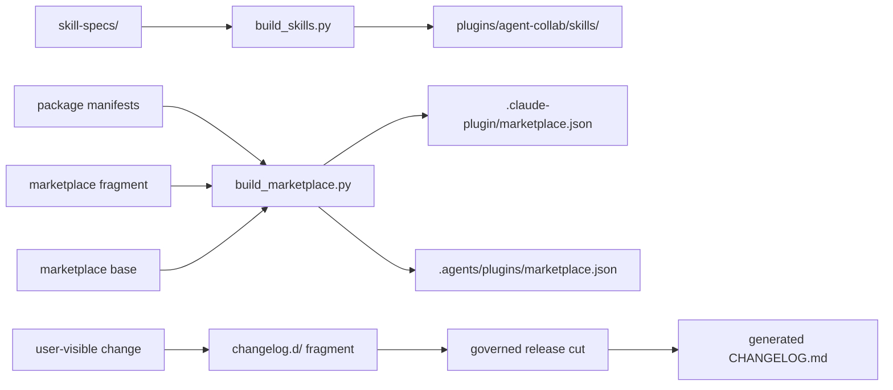

# Repository and release architecture

< [Architecture handbook index](README.md)

This repository publishes one package, `plugins/agent-collab`. It is the public
source of truth for skills, policy, client behavior, migration, governance, and
release-safety checks. The native producer is a separate private trust domain;
contributors do not need access to it.

## Repository map

| Path | Status | Responsibility | Edit rule |
| --- | --- | --- | --- |
| `skill-specs/` | current | Editable source for collaboration skills. | Edit here; do not hand-edit generated copies. |
| `plugins/agent-collab/skills/` | generated/current | Host-readable installed skill contracts. | Regenerate with `scripts/build_skills.py`. |
| `plugins/agent-collab/` public Python modules | current | Coordinator, identity/authority policy, migration, runtime verification/management, and signing policy. | Keep the public module inventory closed. |
| `plugins/agent-collab/project-estimation-data/` | current bootstrap contracts and evidence | Strict request/result and maintenance schemas plus one privacy-safe aggregate/pricing/quota handoff and version-bound receipt. | Never add raw evidence; admit only closed, receipt-declared members. |
| `plugins/agent-collab/.claude-plugin/` and `.codex-plugin/` | current | Host manifests for the same name and version. | Update together. |
| `.claude-plugin/` and `.agents/plugins/` | generated/current | Claude-compatible and Codex marketplace views. | Regenerate with `scripts/build_marketplace.py`. |
| `plugins/agent-collab/runtime-manifest.json` | current contract | Closed runtime artifact and route metadata. | Generated/reviewed release input; never use it to infer host activation. |
| `plugins/agent-collab/runtime/` | repository-only when present | Final manifest-listed native bundle. | Only final reviewed signed artifacts may enter. No native source. |
| `docs/architecture/` | current | Public architecture handbook. | Update with boundary or lifecycle changes. |
| `docs/design/` | mixed | Design-of-record and historical review evidence. | Consult the design index and source/tests before treating it as current. |
| `docs/public-governance.md` | current/normative | Contribution and merge contract. | Keep prose and automation aligned. |
| `docs/migration-from-legacy-packages.md` | current | Retirement, cleanup, safe mode, and package migration. | Do not revive retired install surfaces. |
| `changelog.d/` | staged | Per-change release-note fragments. | Commit one unique fragment; do not compile `CHANGELOG.md` on feature branches. |
| `CHANGELOG.md` | generated | Release-time compilation of fragments. | Updated only by the release flow. |
| `scripts/` | current | Build, validation, compliance, archive, evidence, and release tools. | Preserve fail-closed behavior and tests. |
| `tests/` | current | Public behavior, security, distribution, and regression contracts. | Update with every changed contract. |
| `.github/workflows/` | current | CI, security, governance, dependency, and release automation. | Full commit-SHA pins and least-privilege workflow tokens. |

## Source and generated flow

Generated files are checked for freshness in CI. A version change is one
logical update across both host manifests, marketplace metadata, generated
skill versions, package/root README version markers, and the changelog
fragment.

## Public/private source boundary

The public repository owns:

- request and result policy;
- model-family and authority decisions;
- skills and generated host-facing documentation;
- runtime client, manifest schema, migration, and management contracts;
- artifact verification and signing-policy anchors;
- tests, CI, contribution governance, and release checks; and
- final distributable legal evidence.

The private producer owns:

- native provider implementation source;
- build credentials and signing keys;
- private build/sign infrastructure; and
- any secret-bearing provider integration material.

The only permitted crossing is a final signed standalone bundle, its closed
manifest metadata, and required license evidence. Public pull-request CI uses
GitHub-hosted runners without private build/sign credentials.

## Release modes

### Project-estimation maintenance prerequisite

Before either release mode proceeds, the governed maintenance workspace must
collect, calibrate, backtest, audit, and refresh pricing/quota evidence, then
provide one content-addressed privacy-safe handoff. The plugin worktree may
receive only the aggregate prior, pricing snapshot, quota snapshot, and
maintenance receipt named by that handoff. The public release process does not
collect private history or silently manufacture a seed.

`scripts/verify_project_estimation_maintenance.py` is the shared validator.
`scripts/check_release_consistency.py` calls it for the local pre-tag gate, and
the release workflow calls it again before archive construction or GitHub
Release creation. `scripts/build_plugin_archive.py` admits project-estimation
members from an exact inventory rather than recursively packaging the data
directory.

Calibration can use a verified last-good artifact through day 60. Official
pricing and numeric quota metadata can use a labeled last-good artifact through
day 90. Stale pricing retains its last successful official retrieval date. A
failed refresh receives one bounded official-source research pass and then an
operator notification if still unsuccessful. Expired pricing becomes
`unpriced`; expired quota becomes `unknown`. Structural, privacy, provenance,
integrity, schema, and material-regression failures always block.

The published v6.2.3 release admits the governed bootstrap aggregate,
pricing/quota snapshots, notification, and schema-3 receipt introduced in
v6.2.0. The enhancement duration prior is descriptive; greenfield and
unsupported metric families remain unavailable. The bootstrap is not promoted
calibration; the refreshed maintenance evidence is receipt-bound to 6.2.3. See
[Project estimation](project-estimation.md).

### Policy-only

A policy-only release has an empty runtime manifest and no native runtime tree
in the archive. Skills, migration, and public policy can install, while all
native model routes remain typed unavailable. The release flow proves the
absence rather than pretending activation evidence exists.

### Activation

An activation release contains exactly one supported standalone bundle and a
schema-4 manifest with runtime protocol 4 and native contract 4 in this
repository generation. Release checks bind the bundle, manifest, wire
descriptor, platform, architecture, minimum operating system, file inventory,
digests, signing profile, hardened runtime, secure timestamp, notarization,
legal notices, and source commit.

Activation evidence establishes the package artifact. Host installation and
readiness remain later evidence planes.

## Change lifecycle

```mermaid
flowchart LR
    Need["Scoped change"] --> Source["Owning source and tests"]
    Source --> Generated["Regenerated package views"]
    Generated --> Fragment["Unique changelog fragment"]
    Fragment --> Local["Local validation"]
    Local --> Review["Independent exact-head review"]
    Review --> PR["Governed pull request"]
    PR --> Main["Merged source baseline"]
    Main --> Tag["Signed annotated tag"]
    Tag --> Release["Verified release assets and evidence"]
    Release --> Install["Host install/update"]
    Install --> Ready["Provider-free readiness"]
    Ready --> Closeout["Final documentation closeout"]
    Closeout --> Complete["Release complete"]
```

Each arrow needs its own evidence. A merged pull request does not create a tag;
a tag does not create a release; a release does not update a host; installation
does not prove readiness.

## Validation layers

Run the repository-required commands from `AGENTS.md`. The principal layers
are:

1. **Generation:** skill and marketplace outputs match their sources.
2. **Unit/regression:** repository and script test roots pass on the supported
   Python matrix.
3. **Distribution:** exactly one public package, correct manifests, no retired
   package trees, and deterministic archives/evidence.
4. **Release consistency:** versions, README markers, marketplaces, manifests,
   changelog inputs, tag rules, and the version/hash/freshness-bound
   project-estimation maintenance receipt agree.
5. **Public-export safety:** active tree and locally reachable history contain
   no provider executor source, raw invocation recipes, credentials, private
   paths, retired trees, or unreviewed artifacts.
6. **Security:** dependency-free secret scan, Gitleaks, CodeQL
   `security-extended`, GitHub secret scanning/push protection, and pinned
   third-party Actions.
7. **Governance:** compliance-trace schema, tier rules, CODEOWNERS, required
   checks, signed commits, and resolved review threads.

## History-scan scope

The public-export history check scans refs available in the local clone. A
clone that retains obsolete refs can fail even when a disposable full clone of
the canonical remote is clean. A clean comparison proves only the recorded
remote snapshot; it does not clear a different clone or prior exposure.

If a publication candidate, canonical fetched ref, credential pattern, or
provenance question remains unsafe, stop publication and follow
[`SECURITY.md`](../../SECURITY.md). Scanner output can itself contain sensitive
paths and object identifiers and must not be pasted into a public issue.

## Final documentation closeout

Documentation alignment is the final stage of a release. Begin it only after
the signed tag and GitHub Release exist, published assets have been verified,
and any required installation, activation, readiness, and live qualification
have completed. The release is not complete until this closeout is merged and
checked against the exact release evidence.

Review and update these public surfaces together:

1. **`docs/architecture/`:** update every page affected by the release. Explain
   the system as a person needs to understand it: begin with a mental model,
   provide a bounded example or lifecycle narrative where it clarifies the
   flow, explain why each important boundary exists, label uncertainty, and
   link claims to authoritative public evidence.
2. **Root `README.md`:** keep the package overview, current-release narrative,
   examples, capabilities, counts, lifecycle links, and security boundaries
   aligned with the released version. Do not turn the README into a second
   protocol reference.
3. **Stale-state reconciliation:** derive version/runtime, logical-action,
   transport-action, source-pair, architecture, and skill counts from the exact
   released manifest or generated inventory. Search the README and handbook for
   the previous version/runtime, superseded counts, retired current-state names,
   and pre-release markers (`future`, `not released`, `implemented on branch`,
   `staged`) attached to shipped features. Disposition every hit as `updated`,
   `historical`, or `verified current`; a clean version grep is not completion.
4. **`CHANGELOG.md`:** verify that the release flow compiled the correct entry
   for the exact tag and that it agrees with the release notes and assets. A
   later clarification uses a new `changelog.d/` fragment and the normal
   governed release path; never rewrite a signed tag or hand-edit generated
   history to imply the released artifact changed.

Use explicit evidence language. For example, “vX.Y.Z is published and its
assets were verified; readiness on this host has not been observed” is useful.
“The latest version is active” collapses several evidence planes and is not.

Public documentation is deliberately layered. Human-facing architecture owns
concepts, examples, lifecycle, boundary rationale, and honest uncertainty. The
[package technical reference](../../plugins/agent-collab/README.md) owns
machine-operational fields and closed interface detail. Public pages must omit
raw provider invocation recipes, private paths, credentials, private
control-plane discovery, and enough executor detail to become a turnkey
specification for a foreign agent. Changelog fragments and release notes
follow the same boundary: record user-visible effect and contract changes at
coarse resolution, and leave private-runtime implementation strategy to the
private producer's records (see
[`changelog.d/README.md`](../../changelog.d/README.md)). The private
producer/workspace may keep the copyable internal operating recipe under its
own governance; this public repository does not enumerate or depend on it.

Finish by running the current repository checks from `AGENTS.md`, including
generation, unit/regression, release consistency, changelog dry-run, active-tree
and history public-export safety, security scanning, and `git diff --check`.
Re-read the affected pages as a human narrative as well as machine-checked
artifacts. Link the public documentation PR to the exact public release. It may
state that a separately governed private companion exists, but must not expose
its repository identifiers or operational detail. Record an explicit `updated`
or `verified current` determination for each of the three surfaces; silence is
not completion.

## Contributor path

1. Read `AGENTS.md` and [`docs/public-governance.md`](../public-governance.md).
2. Work from a current topic branch or isolated worktree.
3. Edit authoritative sources, regenerate outputs, and add one unique fragment.
4. Run focused checks and the required full suites.
5. Record the PR compliance trace and independent review required by the tier.
6. Resolve review threads and merge normally after all required checks pass.
7. Treat release/tag work as a separate governed lifecycle.
8. After all other release tasks, complete the documentation closeout above.

The package reference documents the low-level coordinator schema. The
architecture handbook should link to that reference rather than duplicate its
field-by-field protocol.
