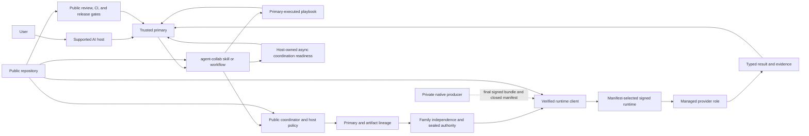

# System context

< [Architecture handbook index](README.md)

`agent-collab` is a source-available plugin that helps a trusted primary AI
agent work with other model families through governed collaboration workflows.
It supplies reusable skills, identity and independence policy, closed managed
routes, migration checks, and release-safety tooling in one package.

The project treats model output as untrusted-but-useful evidence. The primary
still interprets the user's goal, integrates any result, runs verification, and
owns the landing decision.

A useful mental model is a guarded handoff desk, not a group chat. The primary
brings a bounded job; policy checks who is eligible to take it and which tools
that role may use; the result comes back to the primary for judgment. The
handoff transfers work, never ownership of the user's objective or permission
to land the result.

## What the project is

- A single plugin package for supported host plugin systems.
- A library of collaboration skills for review, planning, assurance,
  delegation, knowledge work, orchestration, and domain expertise.
- A public policy boundary that resolves primary and artifact lineage, excludes
  ineligible families, and seals route authority.
- A verified client for an optional co-packaged native runtime.
- A migration and safe-mode boundary for retiring older package generations.
- A public contribution, CI, and release contract that can be applied without
  access to the private native producer.

## What the project is not

- It is not a general-purpose “AI swarm” that grants every agent equivalent
  authority.
- It is not a raw wrapper around provider command-line tools.
- It does not publish provider executor source, provider credentials, raw
  invocation recipes, downloaders, or post-install execution hooks.
- It is not a collection of host- or provider-specific plugins.
- It does not make every listed skill or route usable on every host.
- It does not let a reviewer, worker, or successful model response merge,
  deploy, change governance, or expand its own permissions.
- It is source-available under PolyForm Strict; it is not an open-source grant.

## System view

The dotted producer edge is intentionally narrow. Contributors can review and
change the public policy, skills, client, schemas, tests, and release checks
without seeing private implementation or signing credentials. Only a final
bundle and the metadata needed to verify it may cross into the public package.

## Actors and authority

| Actor or boundary | Responsibility | Authority not granted |
| --- | --- | --- |
| User | Sets the objective, constraints, and any reserved decisions. | No requirement to understand provider transport or package internals. |
| Supported host | Loads the plugin and exposes its skills in the host's normal interaction model. | Does not redefine model family or route authority. |
| Trusted primary | Interprets intent, selects a workflow, reviews output, applies changes, tests, and decides what to land within user authority. | Cannot turn same-family output into independent governance evidence. |
| Skill | Encodes one public workflow and its triggers, evidence needs, and stop conditions. | Does not prove the underlying managed route is active. |
| Public coordinator and policy | Resolve current identity, family eligibility, route/action pairing, and typed preflight results. | No raw provider, binary, credential, or arbitrary tool selection. |
| Managed reviewer | Returns bounded read-only critique or governance evidence. | No source mutation, merge, deployment, or self-approval. |
| Managed worker | Returns bounded output under its declared authority. | No hidden promotion from output-only to caller-workspace mutation. |
| Async target | Participates through a host-owned, explicitly addressed handoff after readiness is observed. | The public coordinator does not send messages or create a synchronous Claude route. |
| Native runtime | Executes the manifest-selected managed contract and returns typed output. | Cannot advertise contracts absent from the closed manifest. |
| Repository governance | Requires trace, review, CI, ownership, and release evidence. | Does not prove that quoted review prose is genuine or replace implementation tests. |
| Operator | Retains reserved merge, release, activation, security, and recovery authority defined by policy. | Is not silently bypassed by agent consensus or green CI. |

## Public package boundary

The installable package contains:

- Claude-compatible and Codex-native manifests for the same package/version;
- generated skills built from the editable `skill-specs/` source;
- coordinator, host policy, migration doctor, runtime client/setup, bundle
  verification, and signing-policy modules;
- the closed runtime and output schemas;
- package legal and third-party notices; and
- for an activation source tree or release, the manifest-listed native bundle.

The package deliberately excludes provider backend source, provider-specific
plugin trees, an MCP server tree, downloader code, and private build/sign
configuration. Tests enforce the public module inventory and retirement
boundary.

## Data and control flow

1. The primary invokes a skill or follows a primary-executed playbook.
2. For a managed route, the public coordinator observes current identity and
   validates the bounded request.
3. Policy excludes the active primary family and, when applicable, the
   artifact-author family from independent review or worker selection.
4. The request receives one declared authority. Fallback cannot widen it.
5. The client validates the manifest and native bundle before the managed
   runtime receives a request.
6. The runtime returns one typed result under the same contract.
7. The trusted primary evaluates the result, applies nothing automatically,
   and runs task-appropriate verification.
8. Pull-request, merge, release, and operator gates remain separate decisions.

## Threat and trust limit

The public runtime boundary narrows artifact substitution, route confusion,
authority promotion, unsafe package state, and uncontrolled provider
invocation. It does not claim isolation from arbitrary malicious code already
running as the same operating-system user. A canonical user home is not a
deny-all-read confidentiality boundary; the implementation uses explicit
same-UID read trust while containing writes, execution/lifecycle state,
provider-state access, and cleanup.

A blocked access attempt inside an established boundary is containment success,
not a failure. A structural containment failure means the boundary could not be
established or there is positive evidence of an escaped write or protected-state
change. Authentication, protocol/output, timeout, provider, teardown, and
cleanup failures remain distinct. Direct CLI invocation is not a normal
fallback for a managed route.

Continue with [Capabilities and workflows](capabilities-and-workflows.md) or
[Governance and authority](governance-and-authority.md).
